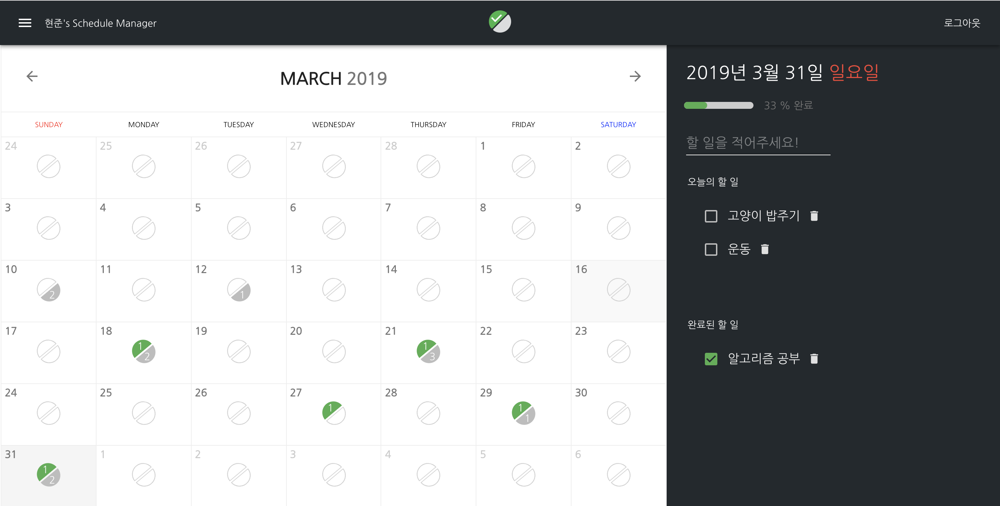

# Personal Schedule Manager

### [Personal Schedule Manager 바로가기](https://myplanner-app.firebaseapp.com/)

#### 개요

개인의 간단한 일정이나 할 일을 날짜에 따라 기록할 수 있는 일정 관리 앱을 구현했습니다.

```
로그인 : test@test.com
비밀번호 : 123456
```

로 사용해보실 수 있습니다.

#### 주요 기능

```
1. 날짜에 따른 할 일 기록 가능
2. 완료되지 않은 할 일과 완료된 할 일을 달력에 표시
3. 회원가입 및 로그인의 구현
4. 반응형 뷰 지원

```

#### 활용 라이브러리

- React
- React-router
- Redux, Redux Thunk
- React Contenteditable
- Material-UI
- Webpack, Babel
- date-fns
- Firebase

#### 서비스 환경

- 반응형 및 터치 이벤트 지원으로 모바일 환경 대응
- IE 11 지원

#### 개선이 필요한 점

- 새로고침 시, 항상 오늘의 날짜로 돌아가게 됩니다. 이 때 주소 표시줄은 새로고침 이전의 날짜를 나타냅니다.

---

##### 완성된 페이지


